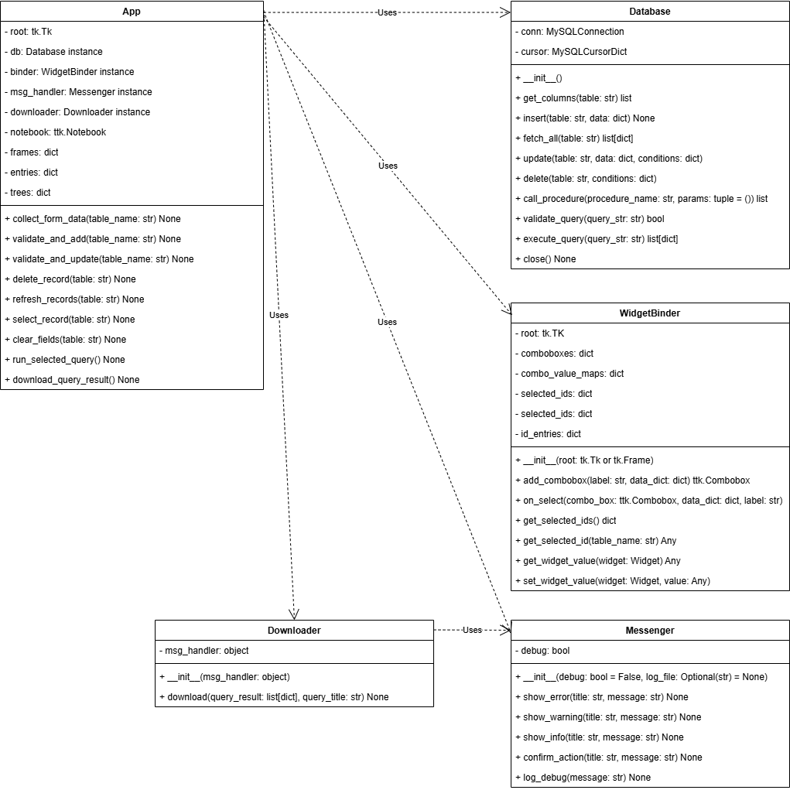

---
output:
  word_document: default
  html_document: default
  pdf_document: default
---

Donnie Minnick
CS727 - Deliverable 5 Solution Readme File
2025-04-30

# Value Measurement Database Application

## Overview

The Value Measurement Database Application is a Python-based graphical user interface 
(GUI) designed to manage transformation initiatives via a connected MySQL database. 
Built with Tkinter, it features a tabbed, user-friendly interface supporting CRUD 
operations across multiple tables.

## Features

- **UI Generation:** Creates input fields based on database schema.
- **Full CRUD Support:** Create, read, update, and delete records for all tables.
- **Scrollable Table View:** Treeview widget with vertical scrolling for large datasets.
- **NULL Handling:** Safely handles empty fields with automatic NULL insertion.
- **Secure DB Connectivity:** Uses mysql.connector with a config.ini for credential management.
- **Built-in Error Handling:** Exceptions are caught and displayed directly in the GUI.
- **Custom Query Execution:** Users can store, run, and download results of complex SQL queries.
- **Preloaded Queries:** Set of preloaded queries to perform complex query operations.  See **User Queries** and **Preloaded Queries** sections below for details.

## Application Demo

I recorded a demo on Loom of the latest feature enhancements to the application.  You 
can use this link to get to the video: [Enhancements Demo Video](https://www.loom.com/share/ef3f3d981ba540a5805fa0251e0883a5?sid=e695830d-adc9-43e8-b64b-a9819933fb9f).

## Installation

### Prerequisites

- Python 3.x
- MySQL Server
- Required Python Packages:
```{bash}
configparser
datetime
logging
mysql-connector
os
re
tkcalendar
tkinter
uuid
```
### Database Setup

1. Create a MySQL database named `value`.
2. Add the following tables:
   - `initiative`
   - `event`
   - `metric`
   - `plan`
   - `event_plan`
   - `global_metric_value`
   - `plan_metric_value`
   - `user_query`
3. Edit `config.ini` with your database credentials.

Separate `create_value_database.sql` file contains MySQL-compliant scripts to generate
normalized database tables with indexes.

## Usage

### Running the Application

Execute the following command:
```bash
python app.py
```
### GUI Guide

- **Switch Tabs:** Each tab maps to a different database table.
- **Add Record:** Fill in inputs and click Add.
- **Update Record:** Select a row, edit inputs, then click Update.
- **Delete Record:** Select a row and click Delete.
- **Refresh:** Reload the latest data from the database.
- **Run Queries:** Save, execute, and download SQL queries from within the GUI.

## File Structure

- `app.py` - Main GUI application.
- `database.py` - Core database interaction class.
- `downloader.py` - Export query results to csv.
- `messenger.py` - Centralized logging and user feedback.
- `widget_binder.py` - Syncs widget values across forms.
- `config.ini` - Stores database connection details (never commit sensitive credentials!)

## Config.ini File Format

This file stores MySQL login credentials and connection details in a 
structured format under a section named [value]. Each line represents a key-value 
pair used to establish a connection to a MySQL database:

- **`host = localhost`:** Specifies that the MySQL server is running on the local machine.
- **`user = XXXXXXXX`:** The username used to connect to the MySQL server.
- **`password = XXXXXXXX`:** Placeholder for the actual password associated with the user.
- **`database = value`:** The name of the database to connect to.

This file can be securely read by the `database.py` using `configparser`. Keep it 
outside version control (e.g., in .gitignore).

## Class Structure Diagram

The following diagram provides a clear visual map of the applicationb structure: its 
classes, attributes, methods, and relationships.



## Error Handling

Exception messages are raised from `database.py` and other classes, and displayed in 
the application using the functionality of `messenger.py`.

To accomplish this, database calls and other functions are wrapped in try-except 
blocks and any error messages are displayed via message boxes.

## SQL Integration

### Database Connection

The Database class connects to MySQL using credentials from `config.ini`.

### Method Summary

| Method                    | Purpose | Example  |
| ------------------------- | ------- | -------- |
| get_columns(table)        | Fetch column names | db.get_columns("users") |
| insert(table, data)       | Insert record with auto-id handling | db.insert("users", {"name", "Alice"}) |
| fetch_all(table)          | Retrieve all rows | records = db.fetch_all("users") |
| update(table, data)       | Update specific rows | db.update("users", {"email", ...}, {...}) | 
| delete(table, conditions) | Delete rows by condition | db.delete("users", {"id", 1}) | 
| validate_query(query_str) | Validate query before execution | db.validate_query("SELECT * FROM users") | 
| execute_query(query_str)  | Execute query string | db.execute_query("SELECT * FROM users") | 
| close()                   | Close the connection | db.close() | 

## Error Handling

- All database interactions are enclosed in try-except blocks.
- Errors are raised and displayed using `messenger.py`.
- Enhances traceability and ensures GUI responsiveness during failures.

## User Queries

The `user_query` table enables use of the application to store custom queries to which 
users may want access for generating specific datasets from the value measurement database.
This table not only stores the query strings, but also enables users to document the queries 
with a title, description and purpose statement.  In addition, users can identify the following 
types of operations used in a given query, including set operation, set membership, set comparison,
subquery, common table expression (CTE), aggregate function, window function and OLAP.

Note that the `Database` class implements a `validate_query` method that prevents
users from saving queries that can potentially damange the database structure or cause data loss.
Essentially, users are limited to SELECT queries.

## Preloaded Queries

The user_query table is preloaded with the following queries.  Separate `preloaded_queries.sql` file 
contains MySQL-compliant scripts for each of these queries.

| Title                                                                | Set Operation | Set Membership | Set Comparison | Subquery | CTE | Aggregate Function | Window Function  | OLAP |
|----------------------------------------------------------------------|---------------|----------------|----------------|----------|-----|--------------------|------------------|------|
| Detecting Anomalous Metric Spikes (Z-Score Calculation)              |               |                |                |          | X   | X                  | X                | X    |
| Identifying Fastest Growing Metrics Over a Rolling Period            |               |                |                |          | X   |                    | X                | X    |
| Rank Metrics by Consistency (Lowest Variation)                       |               |                |                |          |     | X                  | X                | X    |
| Rank Metrics by Volatility (Highest Variability)                     |               |                |                |          |     | X                  | X                | X    |
| Event Row Number Assignments by Event Date                           |               |                |                |          |     |                    | X                | X    |
| First and Last Recorded Value for Each Metric                        |               |                |                |          | X   |                    | X                | X    |
| Rank Metrics by Most Frequently Tracked                              |               |                |                |          |     | X                  | X                | X    |
| Identify Top 3 Events That Impact the Most Metrics                   |               |                |                |          |     | X                  | X                | X    |
| Metric with the Most Plan Associations                               |               |                |                |          |     | X                  | X                | X    |
| Identify Metrics with Longest Periods of Inactivity                  |               |                |                |          | X   | X                  | X                | X    |
| Rolling 90-day Average for Each Metric                               |               |                |                |          |     | X                  | X                | X    |
| Assign Plan Groups to Quartiles                                      |               |                |                |          |     |                    | X                | X    |
| Cumulative Distribution of Metric Values                             |               |                |                |          |     |                    | X                | X    |
| Percent Change Over Rolling 4-Week Window                            |               |                |                |          | X   |                    | X                | X    |
| Running Total of Metrics Per Initiative                              |               |                |                |          |     | X                  | X                | X    |
| Rollup of Events by Initiative                                       |               |                |                |          |     | X                  |                  |      |
| Aggregating Plan Metrics by Cube                                     |               |                |                |          |     | X                  |                  |      |
| Average Metric Value Per Initiative                                  |               |                |                | X        |     | X                  |                  |      |
| Combined Event and Plan Count Per Initiative Using Union             | X             |                |                |          |     |                    |                  |      |
| Common Initiatives with Events and Plans Using Intersect             | X             |                |                |          |     |                    |                  |      |
| Initiatives with Events but No Plans Using EXCEPT                    | X             |                |                |          |     |                    |                  |      |
| Filter Events for Specific Initiatives Using IN                      |               | X              |                |          |     |                    |                  |      |
| Filter Events for Initiatives Not in a Specified Set Using NOT IN    |               | X              |                |          |     |                    |                  |      |
| Filter Events Where Actual Value Exceeds All Values from a Subquery  |               |                | X              |          |     |                    |                  |      |
| Filter Events Where Actual Value Exceeds Any Value from a Subquery   |               |                | X              |          |     |                    |                  |      |
| Filter Events Where Actual Value Exceeds Some Value from a Subquery  |               |                | X              |          |     |                    |                  |      |


## Security Considerations

- Use environment variables or secrets managers in production.
- Never hardcode credentials.
- Sanitize and validate all user inputs.
- Consider role-based permissions in MySQL.

## Future Enhancements

- User authentication and access control.
- Advanced filtering and search functionality.

## License

This project is intended for academic use. Contact the author for usage permissions.

## Author

Developed by Donnie Minnick
For Deliverable 5 – CS727: Relational Database Implementation and Applications
IIT Master's in Data Science Program

